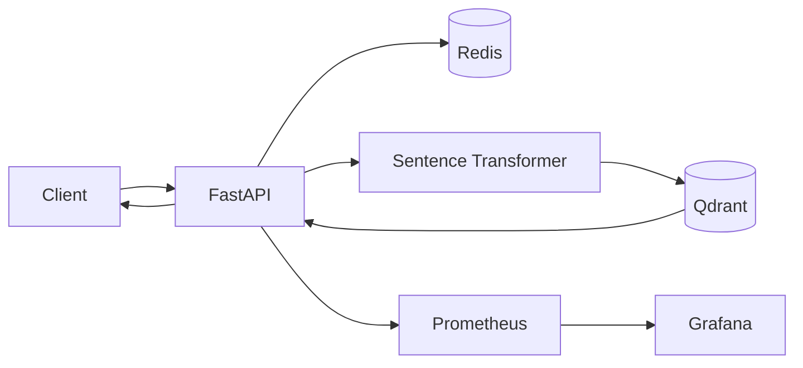

# Recommendation Engine API


A compact backend showcase for **semantic real-estate recommendations**.

The service combines vector similarity search with structured filters, Redis caching, containerized infrastructure and Prometheus metrics.

> **Scope:** portfolio project focused on backend architecture and infrastructure patterns rather than a production recommendation model.

## What it demonstrates

- semantic search with Sentence Transformers and Qdrant;
- cosine-similarity vector retrieval;
- structured filtering by price range and number of rooms;
- Redis caching with a 5-minute TTL for repeated queries;
- FastAPI HTTP API and automatic OpenAPI documentation;
- Prometheus metrics;
- Grafana + Prometheus in the local Docker Compose stack;
- API tests;
- automatic Qdrant collection initialization with sample data.

## Architecture



A request is checked against Redis first. On a cache miss, the query is converted to an embedding, optional payload filters are built, and Qdrant performs vector search. The response is cached before being returned.

## Tech stack

| Area | Technology |
| --- | --- |
| API | Python 3.10, FastAPI |
| Embeddings | Sentence Transformers |
| Default model | `all-MiniLM-L6-v2` |
| Vector search | Qdrant |
| Cache | Redis |
| Observability | Prometheus, Grafana |
| Packaging | Docker, Docker Compose |
| Tests | Pytest |

## Quick start

```bash
git clone https://github.com/theDAREK497/recommendation-engine-api.git
cd recommendation-engine-api
docker compose up --build
```

The application initializes the Qdrant collection and loads the bundled sample property data when needed.

### Local services

- API: `http://localhost:8000`
- OpenAPI / Swagger: `http://localhost:8000/docs`
- Metrics: `http://localhost:8000/metrics`
- Qdrant dashboard: `http://localhost:6333/dashboard`
- Prometheus: `http://localhost:9090`
- Grafana: `http://localhost:3000`

## API example

```http
GET /recommend?query=квартира+москва&min_price=10000000&max_price=20000000&rooms=2
```

Response shape:

```json
{
  "query": "квартира москва",
  "results": [
    {
      "id": 1,
      "score": 0.82,
      "payload": {
        "title": "2-комн. квартира в Москве",
        "price": 15000000,
        "rooms": 2
      }
    }
  ]
}
```

The exact score depends on the configured embedding model and data.

## Project structure

```text
app/
  main.py           FastAPI endpoints, filters and Redis cache
  qdrant_utils.py   embedding model, collection setup and vector search
  healthcheck.py    Qdrant readiness check
data/                sample property data
tests/               API tests
prometheus.yml       Prometheus configuration
docker-compose.yml   local service stack
```

## Tests

```bash
pytest
```

## Production considerations

A production recommendation service would normally add:

- persistent ingestion/source pipelines;
- versioned embeddings and evaluation;
- schema validation;
- authentication and rate limiting;
- cache invalidation strategy;
- tracing and structured logging;
- model and retrieval monitoring.

Keeping these concerns explicit is part of the purpose of this repository.

## License

MIT. See [LICENSE](LICENSE).
